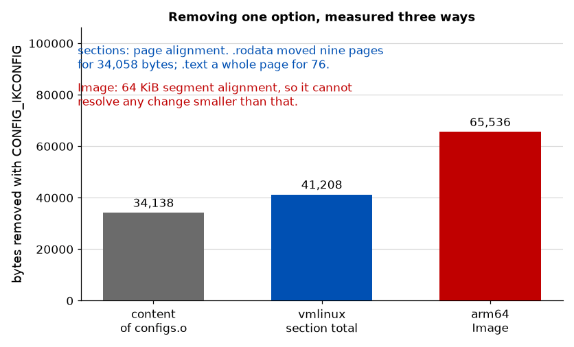

# Paper B - Solutions

Model answers for [`paper_b.md`](./paper_b.md), with marks shown per part.

**Code questions are answered as checklists** of what a correct answer must contain, not as
listings. Two correct answers will not look alike, syntax is not marked, and a worked listing here
would be a solution to the lecture lab that asks for the same thing.

This paper is about failure, so most marks are in the second half of each answer: not what is
wrong, but what it does to a running system that reports nothing. A script that returns a number
and a script that returns the right number are indistinguishable from the outside, and several
questions turn on exactly that.

---

## Question 1 - What leaves the building, and when it does not (10 marks)

**a) (1)** *If I give somebody this binary, what am I obliged to give them along with it?*

Any phrasing that puts the obligation on **distribution** earns the mark. Answers about "whether
the code is free" or "whether we can use it" do not; using software you have is rarely the
question, and it is distributing it that triggers everything.

**b) (3)** **Wrong: "all our code."** Application code that talks to the kernel through system
calls is not a derived work of the kernel, and its licence is your own business.

**Right:** the *kernel* is GPL-2.0-only, so the kernel you ship, including any modifications and
any in-tree driver you added, must be published; and so must every other GPL component in the
image.

**The text that settles it** is the syscall exception, which the kernel's `COPYING` declares at
its head and `LICENSES/exceptions/Linux-syscall-note` states: user programs using kernel services
by normal system calls are not considered derived works. One mark each, and the third only for
naming `COPYING` or the syscall exception specifically rather than gesturing at "the GPL".

**c) (3)** **Complete corresponding source** for every GPL component in the shipped image: the
source at the exact version shipped, the `.config`, the device tree sources, the scripts that
control compilation and installation, and enough instructions to rebuild the binary you shipped.
For **three years** from the last distribution of that product.

**The engineering consequence** is that your build must still work in three years' time. That means
archiving the toolchain and not merely naming it, pinning every source and not tracking a branch,
keeping the `.config` as a build artefact rather than as somebody's working file, and being able to
identify which source corresponds to which shipped unit. It is a version control and artefact
retention problem, and it lands on whoever owns the build.

One mark for the contents, one for three years, one for a consequence that is about reproducing an
old build rather than about lawyers.

**d) (2)** The script counts **strings, not licences.** SPDX has current and deprecated spellings
of the same licence, and a tree written over several years contains both: `GPL-2.0` and
`GPL-2.0-only` are one licence, `GPL-2.0+` and `GPL-2.0-or-later` are another, and dual-licensed
files carry an `OR` expression that a naive grep counts as a licence in its own right.

One mark for identifying the deprecated-alias problem, one for a concrete pair. A candidate who
says only "the script has a bug" earns nothing; the question is which bug.

**e) (1)** Half a mark each:

* **Nobody labels their own file `Proprietary`.** The absence of a tag is what proprietary looks
  like, so the interesting files are the untagged ones and the script does not report those at all.
* **The tree is not the product.** The shipped image contains binaries with no source in this tree:
  firmware blobs, prebuilt vendor libraries, the toolchain's own runtime.

---

## Question 2 - A number that is not what it says (12 marks)

**a) (2)** Too small, by a factor of **2.5**.

The figures are in units of `USER_HZ`, which is 100 and fixed by the ABI, so the correct conversion
is to divide by 100. Dividing by 250 gives $100/250 = 0.4$ of the true value. One mark for the
factor, one for the direction. A candidate who answers 2.5 without direction earns one.

**b) (3)** $447 / 100 = 4.47$ seconds.

It is not a mistake because **`/proc/stat`'s first line sums over all CPUs.** With two CPUs, 2.50 s
of wall clock offers 5.00 s of CPU time, and 4.47 s of it was idle: the machine was about 89% idle,
which is the sensible reading. One mark for the conversion, two for the explanation.

A candidate who says "the machine was idle for 4.47 s" has read the number correctly and understood
it wrongly.

**c) (2)** One mark each:

* **`sleep 1` does not sleep for one second**, it sleeps for at least one second, and the interval
  actually measured also contains the script's own fork and exec on both sides. Dividing by the
  requested interval rather than by the elapsed one, which `/proc/uptime` will give you, builds in
  an error you never see.
* **The script perturbs what it measures.** Sampling `/proc/stat` means forking, reading and
  parsing, all of which cause context switches of their own, and on an otherwise idle machine the
  measurement is a substantial fraction of the activity.

**d) (2)** A spread that large means the quantity **has no single value**: context
switch rate on an idle machine is a property of the particular moment, dominated by whatever
happened to run, not a characteristic of the machine. Any single run is a sample, not a
measurement.

It should be reported to **one significant figure at best**, and honestly to none: what you can
report is a range. One mark each. A candidate who says "take the average of the ten" has missed
that averaging a quantity with no stable value produces a number with no meaning, and earns one.

**e) (3)** Measured over 200 repetitions at `HZ=250`, where one jiffy is 4 ms:

| Call         | Measured     |
| ------------ | ------------ |
| `msleep(1)`  | **8,000 us** |
| `msleep(4)`  | **8,000 us** |
| `msleep(10)` | 15,998 us    |

**`msleep(1)` and `msleep(4)` are the same** because `msecs_to_jiffies` rounds up to the same value:
both 1 ms and 4 ms become **one jiffy**, and both then sleep the same two ticks. Asking for a
quarter as long buys nothing at all.

**The extra jiffy comes from `schedule_timeout`**, not from `msleep`. Its guarantee is that *at
least* the requested number of jiffies pass, and since the call arrives at an arbitrary point inside
the current jiffy, the remainder of that jiffy cannot be counted; so N requested jiffies cost N+1
ticks. The model $(\texttt{msecs\_to\_jiffies}(n) + 1)$ jiffies predicts all three exactly.

One mark for the figures, one for the rounding-up collision, one for locating the extra tick in
`schedule_timeout`. Figures within a few percent are fine; the two equal ones must be equal.

---

## Question 3 - An option that did not survive (10 marks)

**a) (3)** `EXPERT` is off in the `defconfig` this build starts from. With `EXPERT` off,
`PREEMPT_RT`'s `depends on` is unsatisfied, so the symbol **has no prompt and cannot be set**; the
line in the fragment survives the merge into `.config` but `olddefconfig` then discards it, because
a symbol whose dependencies are unmet takes its default and the default is off.

Nothing warns, because a fragment line for an unsettable symbol is not an error in the Kconfig
model; it is simply a request that could not be honoured.

Two marks for the dependency chain, one for saying the line is silently dropped rather than
rejected.

**b) (2)** **A build error stops you.** This produces a kernel that builds cleanly, boots, runs, and
is wrong, so it goes on to be measured, compared and reported as an RT kernel. Every number taken
from it is a number about the wrong kernel.

**The first symptom** is that `/proc/version` or `uname -a` says `PREEMPT` where it should say
`PREEMPT_RT`, closely followed by RT features being absent: no `[irq/N-...]` threads for interrupts
that should be threaded, and latency figures indistinguishable from the non-RT kernel. One mark
each. Accept "the latency measurement showed no improvement" as the symptom.

**c) (2)** **Re-read the fragment after `olddefconfig` and check each of its assignments against the
final `.config`**, warning on any that did not survive; the course's own `ci/kernel.sh` does this.

**What makes it possible** is that the fragments are separate files containing explicit
`CONFIG_X=y` assignments, so the *intent* exists in machine-readable form separately from the
result. You cannot perform this check against a hand-edited `.config`, because there is nothing left
to compare it to.

One mark for the check, one for identifying the separation of intent from result as the thing that
makes it writable.

**d) (3)** Both gaps are **alignment**, and in neither case did any code disappear.

*34,138 to 41,208.* The object's bytes do not land in one section, and each section that loses
bytes is itself aligned, so it shrinks by whole units rather than by what was removed:

| Section      | Delta      | Content `configs.o` put there              |
| ------------ | ---------- | ------------------------------------------ |
| `.rodata`    | 36,864     | 34,058, the compressed config and a string |
| `.text`      | 4,096      | 76                                         |
| `.init.text` | 112        |                                            |
| `.rela.dyn`  | 96         |                                            |
| `.exit.text` | 40         |                                            |
| Elsewhere    | 0          | 4, the initcall entry                      |
| **Total**    | **41,208** | **34,138**                                 |

Two sections carry almost all of it and both moved by an exact multiple of the 4,096-byte page:
`.rodata` by nine pages for 34,058 bytes of content, and `.text` by a **whole page for 76 bytes**.
The remaining 248 bytes are the sections that are not page-aligned. Removing a thing removes its
padding with it, so the section total moves by more than the thing measured.

*41,208 to 65,536.* `Image` is a flat binary whose segments arm64 aligns to **64 KiB**;
`SEGMENT_ALIGN` is `SZ_64K` in `arch/arm64/include/asm/memory.h` and `vmlinux.lds.S` aligns each
segment to it. So the `Image` delta is quantised: it moves in whole 65,536-byte steps, and here
41,208 bytes of sections happened to cost exactly one. A second option of the same size need not
shrink it again by 65,536, and a small option may not shrink it at all; which it does depends on
where each segment ends relative to the next 64 KiB boundary.

One mark for page alignment of the sections, one for the 64 KiB segment quantisation, one for
concluding that the `Image` figure cannot resolve anything below 64 KiB and is therefore the wrong
measurement to quote. **Link-time garbage collection is the plausible wrong answer** and earns
nothing on its own; nothing was collected, and every byte is accounted for by padding.

Candidates are not expected to reproduce the per-section table from memory. Full marks for naming
both alignments and the direction of each gap.

---

## Question 4 - A module that will not load (12 marks)

**a) (4)** Three causes, one mark each, plus one for a method that actually separates them.

1. **The module that exports the symbol is not loaded.** Nothing provides it.
2. **The symbol exists but is not exported.** The provider is loaded, the function is there, but it
   carries no `EXPORT_SYMBOL`, so it is invisible to the module loader.
3. **The symbol is `EXPORT_SYMBOL_GPL` and your module's `MODULE_LICENSE` is not GPL-compatible.**
   The loader deliberately does not see it.

**Distinguishing them:** `grep qa_answer /proc/kallsyms`. Absent means cause 1, and `lsmod`
confirms.
Present means cause 2 or 3, and `modinfo -F license` on your own module settles it: a
GPL-compatible licence leaves only cause 2, which the provider's source confirms by the missing
`EXPORT_SYMBOL`.

**b) (3)** **Cause 3.** Your module is correct, the provider is loaded, the symbol is present in
`/proc/kallsyms`, and the message says `Unknown symbol`.

It is misleading because the loader does not report a licence violation; it **hides GPL-only symbols
from a GPL-incompatible module**, so the lookup genuinely fails and the loader reports, accurately,
that it could not find the symbol. Nothing in the message mentions licensing, and the symbol is
plainly there to anyone who looks.

Two marks for the mechanism of hiding rather than refusing, one for noticing that the message is
technically true. This path is normally reached after a kernel upgrade turns an `EXPORT_SYMBOL` into
an `EXPORT_SYMBOL_GPL`, since a fresh build would have been stopped at modpost; a candidate who says
so earns full marks comfortably.

**c) (2)** **`vermagic` disagreed.** The string built into the `.ko` records the kernel version,
SMP, the preemption model, module unloading and `modversions`, and it did not match the running
kernel's.

The fix is to rebuild the module against the exact kernel it will load into. `modinfo -F vermagic
mine.ko` against the target's own string identifies which field differs; the common cause in this
course is switching between the `PREEMPT` and `PREEMPT_RT` builds and leaving stale objects behind.
One mark each.

**d) (2)** The **modpost** failure is better.

It arrives **at build time on your own machine, names the licence, the module and the symbol, and
produces no `.ko` at all**, so the defect cannot leave the build. The `insmod` failure arrives on
the target, possibly at a customer, says `Unknown symbol` and does not mention the actual cause;
diagnosing it requires already knowing this mechanism exists.

One mark for the choice with the build-time argument, one for contrasting the quality of the two
messages.

**e) (1)** `Disabling lock debugging due to kernel taint`.

**Lockdep is now off for the rest of the boot.** Every lock-ordering bug that the validator would
have caught passes silently from this point, and the only way back is a reboot without that module.

---

## Question 5 - A read that returns zero (12 marks)

**a) (8)** Two marks each: one for naming the defect, one for the consequence.

**`return 0` when the FIFO is empty.** Zero means **end of file**. `cat` exits, a
`while (read(...) > 0)` loop terminates, and the program concludes the device is finished when it
has merely not produced anything yet. It should block, or return `-EAGAIN` under `O_NONBLOCK`.

**`memcpy` to a `char __user *`.** No verification that the address belongs to the caller, no fault
handling if the page is not present, and no `__user` checking. An unmapped address oopses inside
the driver; a kernel address supplied by the caller is written to happily. Must be `copy_to_user`,
whose return is the number of bytes **not** copied.

**The copy happens under `spin_lock_irqsave`.** `copy_to_user` may sleep, because the destination
page can be paged in on demand, and this is atomic context with interrupts disabled. With
`CONFIG_DEBUG_ATOMIC_SLEEP` it is a `might_sleep` splat; without it, the machine can deadlock or
corrupt. Copy into `tmp` under the lock, drop the lock, then copy out.

**`return count` rather than `n`.** Claims more bytes were delivered than were written. Only `n`
bytes were copied, so the caller takes whatever its own buffer already held past `n` as data from
the device: the byte stream is silently corrupted, and a short read, which is normal, is never seen
as one.

Accept, for partial credit within a defect the candidate has otherwise missed, the observations that
`priv` is never derived from `file->private_data` and that a 64-byte array on a small kernel stack
is unwise. Neither is one of the four.

**b) (2)** Half a mark each: the byte count actually delivered, which may be short; sleep until data
arrives, then that count; `-EAGAIN`; `-ERESTARTSYS`.

**Zero is correct in none of the four**, and offering it for the second or third is the defect in
**a)** restated.

**c) (2)** With no `.poll` method, the VFS applies the default mask, which reports the file as
**always readable and always writable**. `select` therefore returns immediately claiming the
descriptor is ready, the program calls `read`, gets `-EAGAIN` on its non-blocking descriptor,
calls `select` again, and **spins at 100% CPU** while appearing to work. On a blocking descriptor
it sleeps in `read` instead, and every other descriptor it was watching waits with it.

The driver must implement `.poll`, calling `poll_wait` on the same wait queue `read` sleeps on and
returning `EPOLLIN | EPOLLRDNORM` only when data is actually available. One mark for the busy loop,
one for `poll_wait` on the same queue.

---

## Question 6 - A mapping that is wrong (10 marks)

**a) (3)** Nothing is decoded at that address, so the read raises a **synchronous external abort**.
The kernel prints an oops naming the faulting instruction and the driver's function.

The state left behind: `insmod` is killed, but **the module is half-loaded**, with whatever it
allocated before the read still held and its init function never having returned. It cannot be
removed, because `rmmod` requires a module that finished loading, and the resources are held until
reboot. The machine survives; that module slot does not.

One mark for the abort, one for `insmod` dying, one for the half-loaded state.

**b) (2)** The **zeros**, decisively.

The abort is immediate, loud, and points at the exact instruction. Reading zeros produces no error
of any kind: the driver believes it has a working mapping, sees an identity register that does not
match and, if it does not check, carries on to configure a device that is not there. The failure
then surfaces somewhere else entirely, at a different time, as a device that does not work, and
nothing in the log connects it to the mapping.

One mark for the choice, one for "no error is worse than an error".

**c) (2)** **"It did not crash" is not evidence of anything.** A wrong mapping has two outcomes and
only one of them is loud, and which one you get depends on what happens to be at the wrong address,
not on how wrong it is. Absence of a fault distinguishes nothing.

The defensive measure that catches both: **read a known identity register and refuse to probe unless
it holds the expected value.** The abort case never reaches the comparison, and the zeros case fails
it, so one check covers both. One mark each.

**d) (3)** Any three, one mark each:

* **The compiler treats it as ordinary memory.** It may cache the value in a register and never
  re-read it, so a loop polling a status register never observes it change; it may merge or discard
  writes it believes are redundant; it may reorder accesses against each other.
* **No ordering.** `readl` and `writel` carry the barriers that make MMIO ordered against other
  accesses and against DMA. A bare dereference carries none, so writes can reach the device in an
  order the driver never wrote.
* **No `__iomem` checking.** Sparse can no longer tell an I/O pointer from a normal one, so this
  class of mistake becomes invisible to the one tool that finds it, throughout the driver and not
  just here.
* **Access width and portability.** The compiler chooses the load width, and many device registers
  require an exact width; and on architectures where I/O needs distinct instructions, the code is
  simply wrong rather than merely fragile.

---

## Question 7 - A deadlock that has not happened (12 marks)

**a) (3)** Lockdep does not watch for deadlocks; it **records the order in which locks are acquired
and builds a graph of those orderings**, one edge per nesting it has ever seen, anywhere, at any
time.

Taking A then B adds the edge A to B. Taking B then A later adds B to A, closing a **cycle**. A
cycle in that graph means an ordering exists under which two threads can deadlock, and lockdep
reports on the edge that closes it, immediately, whether or not anything was concurrent.

Two marks for the graph-of-orderings model, one for saying the report is about the *possibility* and
fires on the first inversion. A candidate who says "lockdep detected a deadlock" has the wrong model
and earns at most one.

**b) (2)** **One CPU.** The columns are **hypothetical**: lockdep constructs the interleaving that
*would* deadlock, to show you what it is worried about. Nothing in the diagram is a record of
anything that happened. One mark each, and the second is the examinable half.

**c) (2)** **Lockdep**, the lock validator, enabled by **`CONFIG_PROVE_LOCKING`**.

The cost is substantial: every acquisition and release is instrumented and checked against the
graph, which is far too slow for production and uses memory that grows with the number of distinct
lock classes. It is also **switched off entirely by the taint a proprietary module brings**, so
loading one ends validation for the boot. One mark for the name and option, one for a real cost.

**d) (3)** Because **the racing module never took a lock.** Lockdep validates statements about locks
that were acquired; where no lock was acquired there is no event to record, no edge to add, and
nothing to contradict. Losing up to 38% of the increments involves no incorrect use of any lock, so
from lockdep's point of view nothing happened at all.

**The general limitation: lockdep finds bugs in the locks you took, not the locks you did not
take.** It cannot know that a variable needed protection, and a clean lockdep report says nothing
whatever about whether your data is protected.

Two marks for the mechanism, one for the limitation stated in general terms.

**e) (2)** Both sentences needed:

The ordering only deadlocks when the two paths interleave inside a window that may be a few
instructions wide, and two years of not hitting a narrow window is evidence about the workload, not
about the code; the machine that hits it will be a faster one, a busier one, or one with more CPUs.

And the argument proves too much: it is the same reasoning that says an unlocked counter is fine
because 2,000 increments per thread never lost one, which this course measured going wrong at
20,000.

---

## Question 8 - An interrupt that never stops (10 marks)

**a) (3)** The device's status bit stays set, so the line **stays asserted**. The GIC sees a level
that is still high, so as soon as the handler returns the interrupt is delivered again, immediately
and forever.

The CPU never leaves interrupt context on that core. **`insmod` never returns**, the console stops
responding, and the machine is unrecoverable without a reset. Two marks for the level-stays-high
mechanism, one for `insmod`.

**b) (3)** The connection is that **the CPU is never available to anything else.** RCU needs every
CPU to pass through a quiescent state for a grace period to complete, and a CPU wedged in an
interrupt handler never does. After the stall timeout, the RCU stall detector notices a grace period
that has not ended and reports it.

The NMI is the detector asking the stuck CPU what it is doing, since it cannot be interrupted by
anything less; the backtrace it returns is what actually names the driver. The message mentions
neither interrupts nor your driver because **RCU is a victim, not the cause**: it is the first
subsystem with a timeout long enough to notice.

Two marks for the quiescent-state argument, one for the NMI's purpose.

**c) (2)** It should report **TIMEOUT**, distinctly from a failure.

A failing test is one that ran, produced a result, and the result was wrong. This produced **no
result at all**: the guest never reached the end of the test, so nothing is known about anything
else the lecture tests either. Reporting it as a failure would imply the harness knows what went
wrong, and treating it as a normal failure hides that every later test in that boot is
unaccounted for. One mark each.

**d) (2)** On an edge-triggered line the controller latches a transition, not a level, so a status
bit left set produces **no new edge and therefore no further interrupt**. You get exactly one
interrupt and then silence: the FIFO fills, `OVERRUN` sets, and the device appears dead while the
machine runs perfectly.

**Which to ship:** neither is shippable, and the honest answer is the trade. The wedge is
undeniable, fires on the first interrupt, and **cannot escape testing**. The silent one passes a
short test, passes review, and fails hours later in the field as an intermittent "device stopped
responding" with nothing in the log.

The position expected: **the wedge**, on the ground that a failure which cannot reach a customer is
preferable to one that reliably does. Full marks for an answer arguing the opposite on
recoverability, that a wedged machine in the field is unrecoverable while a dead device may be
restarted, provided it states that trade explicitly rather than merely preferring the quieter
symptom.

---

## Question 9 - A driver that finds its own hardware (6 marks)

**a) (3)** Three quarters of a mark each. Order matters: each step is cheaper than the next and
rules out everything below it.

1. **Does the device exist?** Is the node in the device tree, is its `status` `okay`, and did a
   platform device appear under `/sys/bus/platform/devices/`? No device, no probe, and nothing about
   the driver is relevant.
2. **Did the driver register?** Is the module loaded and does `/sys/bus/platform/drivers/<name>/`
   exist? A driver that failed to register cannot match.
3. **Do the strings match exactly?** The `compatible` in the DT against the `of_match_table` entry,
   character for character, including the vendor prefix. This is the usual answer.
4. **Is the match table actually wired in?** `.of_match_table` assigned into the `struct
   platform_driver`'s `.driver` member, and the table terminated by an empty entry. A table that
   exists but is not attached matches nothing and warns about nothing.

**b) (2)** **All three are released at unbind**, while the module stays loaded: the memory region
disappears from `/proc/iomem`, the interrupt is freed and its line disappears from
`/proc/interrupts`, and the sysfs attributes are removed. Rebinding runs `probe` again and brings
them all back.

What it tells you: **`devm_` is attached to the device, not to the module.** The lifetime it manages
is the bind, and unloading the module is merely the most common way for a bind to end, not the thing
being tracked. One mark each.

**c) (1)** **A machine with two of these devices.** The second `probe` overwrites the pointer the
first stored, so both devices then operate on the second one's mapping, and the first device
silently stops working while both appear to have probed successfully.

---

## Question 10 - Worse average, better maximum (6 marks)

**a) (2)** A **throughput** reviewer prefers `PREEMPT`: its mean is 449 us against 551 us, so the
average path through the system is 19% cheaper, and RT's overhead is real work being done on every
interrupt.

A **real-time requirement** demands `PREEMPT_RT`: its maximum is 4,964 us against 11,321 us, a
factor of 2.3. A deadline is a statement about the worst case, and no average is evidence about a
maximum.

Both read correctly because **the table describes a trade rather than an improvement**:
`PREEMPT_RT` buys a better bound by paying for it on every sample. One mark for the pair of
readings, one for naming the trade rather than declaring a winner.

**b) (2)** The same kernel, measured again, moved its maximum from 11,321 us to 2,502 us: **a factor
of four and a half, on one kernel, changing nothing.** That is larger than the kernel-to-kernel
difference the table is being used to demonstrate, so **the table supports no conclusion at all.**
The comparison is inside the noise of its own method.

To draw one safely: many runs of each configuration, reported as a distribution rather than a single
maximum, with the run-to-run spread stated alongside; and for a bound, the interesting statistic
is a high percentile over a long run, not the maximum of two thousand samples. One mark for
invalidating the conclusion, one for what would replace it.

**c) (2)** Any two, half a mark each: **QEMU itself**, whose device emulation and timer delivery sit
directly in the measured path; **the host kernel**, which schedules the QEMU process and can preempt
it mid-interrupt; the host's own load; the host's power management and frequency scaling.

**What survives:** the **direction and the shape** of the comparison. `PREEMPT_RT` trading a worse
mean for a better maximum is a real property of what it does, and it is visible here because the
mechanism is real even when the timings are not.

**What does not survive: every absolute number, and the factor.** Not "approximately correct" but
worthless, because the dominant term is the host and not the guest. A candidate who carries "RT is
2.3 times better" out of this course has taken the one thing the measurement cannot support. One
mark for the components, one for separating shape from magnitude.

---
