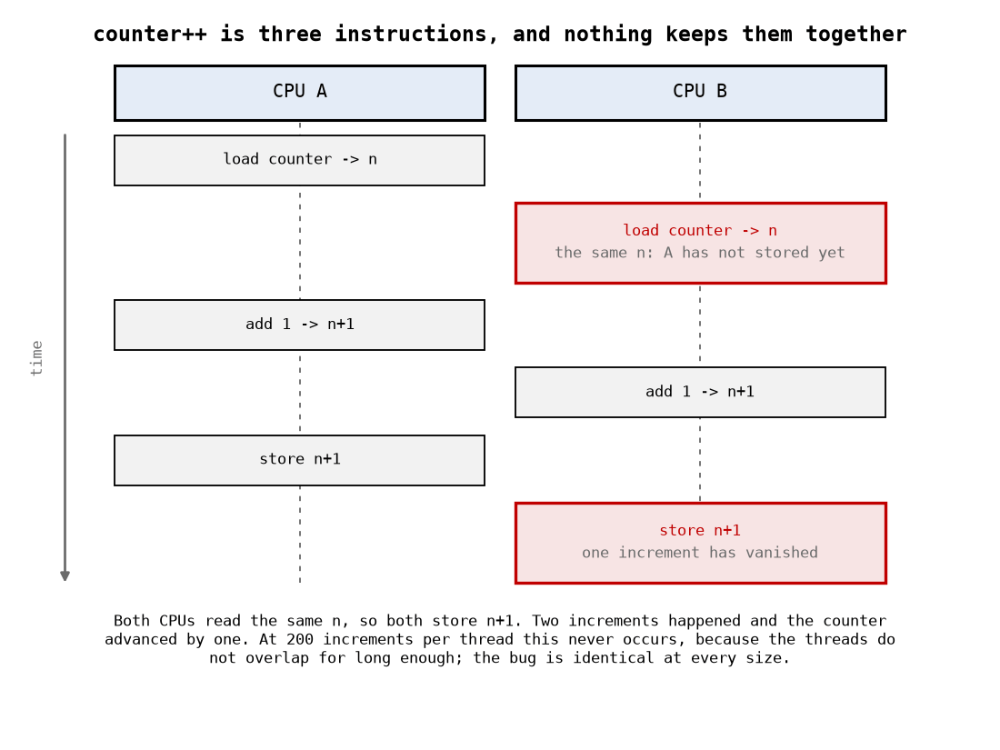
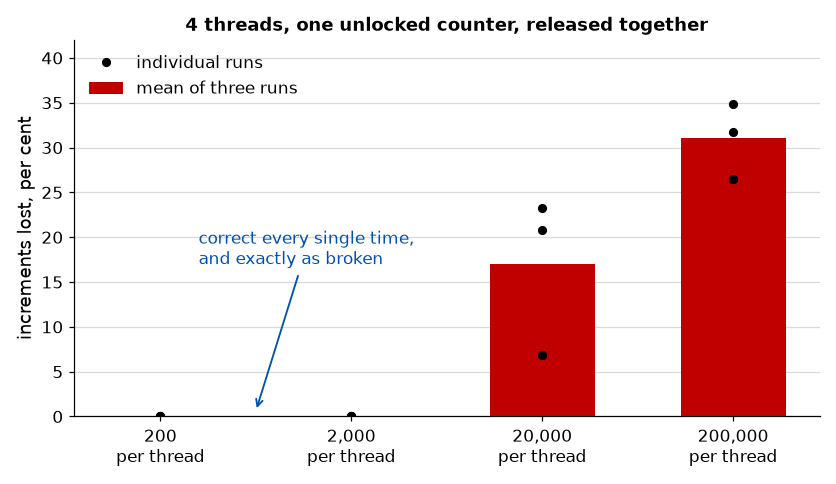

# Appendix A - Where Concurrency Comes From, and What to Do About It
Five ways two pieces of kernel code can run at once, what each of the locking primitives costs, and
the single question that chooses between them. [Appendix B](./b_deadlock_and_lockdep.md) is
deadlock and the tool that finds it.

The idea to carry: **every locking decision in the kernel is downstream of one question, which is
whether the code holding the lock is allowed to sleep.** Get that right and the rest follows. Get
it wrong and the failure is a deadlock under load on a machine you do not own.

---

## A.1 Five sources, two of which you have already met

| Source         | Another thread of control appears because                    | First met in |
| -------------- | ------------------------------------------------------------ | ------------ |
| **SMP**        | Another CPU is running your code at the same time            | L03          |
| **Preemption** | The scheduler stops you mid-function and runs something else | L03          |
| **Interrupts** | A device raised a line and your handler runs                 | L08          |
| **Timers**     | Something you scheduled earlier fires                        | L09          |
| **Workqueues** | Deferred work you queued runs on a kernel thread             | L08          |

On a single-CPU kernel built with `PREEMPT_NONE`, only the interrupt is left, with the timers that
fire on the way out of one, and a great deal of old driver code is written for exactly that world.
**Copying it is dangerous**, because the two assumptions it makes silently, that nothing else runs
your code and that you cannot be stopped mid-function, are both false on the target this course
boots.

That target has two CPUs and `CONFIG_PREEMPT=y`, which is the ordinary configuration of a modern
embedded Linux, and it is enough to lose data in a way you can measure in about a second.

---

## A.2 What a race actually costs

The lab's `qa_race` module runs four kernel threads, each incrementing a shared counter twenty
thousand times, so 80,000 increments are expected. Ten consecutive unlocked runs on this target:

```text
expected=80000 actual=78436 lost=1564
expected=80000 actual=73529 lost=6471
expected=80000 actual=70292 lost=9708
expected=80000 actual=67722 lost=12278
expected=80000 actual=63562 lost=16438
expected=80000 actual=63195 lost=16805
expected=80000 actual=62715 lost=17285
expected=80000 actual=62525 lost=17475
expected=80000 actual=53455 lost=26545
expected=80000 actual=49953 lost=30047
```

**Between 2% and 38% of the work vanished, and no two runs agree.** With the spinlock switched on,
every run returns exactly 80,000.

`counter++` is not one operation. It is a load, an add, and a store, and two CPUs interleaving
those three steps lose one of the two increments. That is all a lost update is.

**The part worth dwelling on is how hard this was to make happen.** The first version of that
module lost *nothing*, three runs in a row, on the same hardware with the same code. The threads
were being created one at a time, and the first finished before the last was created, so they never
overlapped. Adding a starting barrier, so all four threads begin together, took the loss from zero
to a third of the total.

Nothing about the code changed. The bug was there the whole time. **A race that does not reproduce
is not a race that is absent**, and "it works on my machine" is usually a statement about timing
rather than about correctness.

The same point again, from the other direction. With the barrier in place and everything else
identical, varying only how much work each thread does:

| Increments per thread | Expected | Loss, three runs    |
| --------------------- | -------- | ------------------- |
| 200                   | 800      | 0%, 0%, 0%          |
| 2,000                 | 8,000    | 0%, 0%, 0%          |
| 20,000                | 80,000   | 23.3%, 20.8%, 6.9%  |
| 200,000               | 800,000  | 31.7%, 34.9%, 26.5% |

**The first two rows are the same broken program, returning the right answer every time.** Below
about ten thousand iterations the threads do not overlap for long enough to collide, even though
they were released together; the work finishes inside the window it takes the other threads to get
going. There is no size at which the code is correct, only sizes at which it has not yet been
caught.

Anyone testing this would reasonably pick a small iteration count, because it is faster. They would
get a clean run, every time, and be wrong.





---

## A.3 Atomics, and the thing they do not fix

```c
atomic_t counter = ATOMIC_INIT(0);
atomic_inc(&counter);
```

`atomic_inc` makes the load-add-store indivisible, and it fixes A.2's counter completely.

**It does not fix a data structure**, and this is the misconception worth the most time. A ring
buffer has a head, a level, and an array, and its invariant spans all three. Making each of them
`atomic_t` makes each individual update indivisible and leaves the invariant exactly as broken:

```c
/* Still wrong, with every field atomic. */
if (atomic_read(&level) < capacity) {      /* another CPU can act here */
        data[(atomic_read(&head) + atomic_read(&level)) % capacity] = byte;
        atomic_inc(&level);
}
```

Two writers can both pass the test, both compute the same slot, and both write to it; one byte is
lost and `level` says two arrived. Atomicity per field buys nothing when the thing that must be
atomic is the *sequence*.

The rule: **atomics protect one variable, locks protect an invariant.** If you can state what must
be true before and after, and it mentions more than one variable, you need a lock.

Useful atomics beyond the counter: `atomic_inc_return`, `atomic_dec_and_test` (returns true when
the result is zero, which is how refcounts are implemented), and `atomic_cmpxchg`.

---

## A.4 The compiler is also a problem

Before the CPU gets a chance to reorder anything, the compiler already has.

```c
while (!flag) { }        /* may never re-read flag */
```

`flag` is not volatile, nothing in the loop changes it, so the compiler may load it once and spin
on a register forever. This is a correct optimisation and an infinite loop.

```c
while (!READ_ONCE(flag)) { cpu_relax(); }
```

`READ_ONCE` and `WRITE_ONCE` force the access to happen exactly once, in the right place. They are
not barriers and they do not order anything against other accesses; they stop the compiler from
inventing, eliding or splitting the access itself.

For ordering between accesses there are memory barriers, `smp_mb()`, `smp_rmb()`, `smp_wmb()`, and
their acquire/release forms. **Most driver code should not be using them directly.** A lock
provides both mutual exclusion and the ordering, and code that reaches for bare barriers is code
that has to be right about the memory model of every architecture it will ever run on.
[Appendix B of L06](../../L06/appendix/b_mmio_and_resources.md#b5-ordering-and-the-_relaxed-variants)
covers the same problem where the other party is a device rather than a CPU.

---

## A.5 Spinlocks

```c
static DEFINE_SPINLOCK(my_lock);

spin_lock(&my_lock);
/* critical section */
spin_unlock(&my_lock);
```

A waiting CPU **spins**, burning cycles until the lock is free. It does not sleep, which is the
whole point: a spinlock is usable from contexts where sleeping is forbidden, and an interrupt
handler is one.

Two consequences:

* **The critical section must be short.** Every cycle spent holding it is a cycle another CPU
  spends doing nothing. Microseconds, not milliseconds.
* **You may not sleep while holding one.** No `kmalloc(GFP_KERNEL)`, no mutex, no `copy_to_user`,
  no `msleep`. Sleeping with a spinlock held can deadlock the machine outright, and
  `CONFIG_DEBUG_ATOMIC_SLEEP`, which this course enables, turns it into a complaint instead.

### The interrupt variants, and why they exist

Consider a lock taken both by a driver's `read()` and by its interrupt handler. Process context
takes the lock; before it releases, the device interrupts *the same CPU*; the handler runs and
tries to take the same lock; it spins, waiting for a lock that will be released by code that
cannot run until the handler returns. The machine stops.

```c
unsigned long flags;

spin_lock_irqsave(&my_lock, flags);     /* disables interrupts on this CPU, saves the old state */
/* critical section */
spin_unlock_irqrestore(&my_lock, flags);
```

| Variant             | Disables                            | Use when                                     |
| ------------------- | ----------------------------------- | -------------------------------------------- |
| `spin_lock`         | Preemption only                     | The lock is never taken in interrupt context |
| `spin_lock_irq`     | Preemption and interrupts           | You know interrupts were enabled             |
| `spin_lock_irqsave` | The same, restoring the prior state | Anywhere. The one to default to              |
| `spin_lock_bh`      | Preemption and softirqs             | The lock is shared with a softirq or tasklet |

`irqsave` rather than `irq` because you may be called with interrupts already disabled, and
blindly re-enabling them on unlock would be a bug in the caller's code that you introduced.

Note that this only guards against the handler on the **same** CPU. Another CPU's handler is
excluded by the lock itself; that is what the lock is for.

---

## A.6 Mutexes

```c
static DEFINE_MUTEX(my_mutex);

mutex_lock(&my_mutex);
/* critical section, may sleep */
mutex_unlock(&my_mutex);
```

A waiting task **sleeps**: it leaves the run queue and the CPU does something else. Which means:

* It **cannot** be used in interrupt context or anywhere else that may not sleep.
* The critical section **may** sleep. `kmalloc(GFP_KERNEL)`, `copy_to_user`, and I/O are all fine.
* It scales better for anything long, because waiters cost nothing while they wait.

`mutex_lock_interruptible` returns `-EINTR` if a signal arrives while waiting, which is what you
want in a driver reachable from a system call; a user pressing Ctrl-C expects something to happen.

### Choosing

One sentence decides it: **can the code inside the critical section sleep, and can the code waiting
for it afford to wait?**

|                                  | Spinlock | Mutex              |
| -------------------------------- | -------- | ------------------ |
| Usable from an interrupt handler | Yes      | **No**             |
| The critical section may sleep   | **No**   | Yes                |
| Waiter burns CPU                 | Yes      | No                 |
| Short critical section           | Good     | Overhead dominates |
| Long critical section            | Terrible | Good               |

If the answer is "an interrupt handler touches this", it is a spinlock and the critical section has
to be short enough to live inside one. If the answer is "this copies to userspace", it is a mutex
and no interrupt handler may touch that data.

Also available: **semaphores**, which are a counting generalisation and are mostly legacy in new
code; and **reader-writer locks** (`rwlock_t`, `rw_semaphore`), which allow concurrent readers.
Reader-writer locks are less of a win than they look, because they are slower than a plain lock in
the uncontended case, and the uncontended case is most of them.

---

## A.7 Atomic context

"Atomic context" means **any context in which the code may not sleep**. You are in it when:

* You are in an interrupt handler.
* You are in a softirq, tasklet or timer callback.
* You hold a spinlock.
* You have disabled preemption or interrupts explicitly.

What is forbidden there is anything that might call `schedule()`:

| Forbidden             | Because                                       |
| --------------------- | --------------------------------------------- |
| `kmalloc(GFP_KERNEL)` | May sleep to reclaim memory. Use `GFP_ATOMIC` |
| `mutex_lock`          | Sleeps when contended                         |
| `copy_to_user`        | May fault, and faulting may sleep             |
| `msleep`, `schedule`  | Obviously                                     |
| `wait_event`          | L09                                           |

**This is not a style rule and there is no "it usually works".** Sleeping in atomic context is a
bug even on the runs where nothing goes wrong, because whether it goes wrong depends on whether
the allocator happened to have memory, or whether the lock happened to be free.

The kernel will tell you, if you ask it to. `CONFIG_DEBUG_ATOMIC_SLEEP`, enabled by
[`kernel/qa.config`](../../../kernel/qa.config) for this course, makes any sleep in atomic context
print a `BUG: sleeping function called from invalid context` with a backtrace. `might_sleep()` is
the annotation that produces it, and it is worth putting at the top of any function of yours that
can sleep, so that a caller who gets it wrong finds out immediately rather than eventually.

---

## A.8 RCU and per-CPU, in one section

Two mechanisms for the case where a lock is the wrong shape. Both are worth recognising; neither is
something to reach for in a first driver.

**RCU** (read-copy-update) is for data read constantly and written rarely. Readers take no lock at
all and pay almost nothing; a writer builds a new version, publishes it with one atomic pointer
store, and waits until every reader that might still hold the old pointer has finished before
freeing it. That waiting is the cost, and it is why RCU suits routing tables and module lists and
not a driver's ring buffer.

**Per-CPU data** removes the sharing instead of protecting it. `DEFINE_PER_CPU` gives each CPU its
own copy, so there is nothing to race over; statistics counters are the classic use, summed across
CPUs only when somebody reads them. `/proc/stat`'s per-CPU lines in
[L02](../../L02/appendix/b_proc_sys_dev.md#b2-the-files-worth-knowing) are exactly this.

The unifying observation: **the fastest lock is the one you did not need**, and both of these are
ways of arranging not to need one.

---
