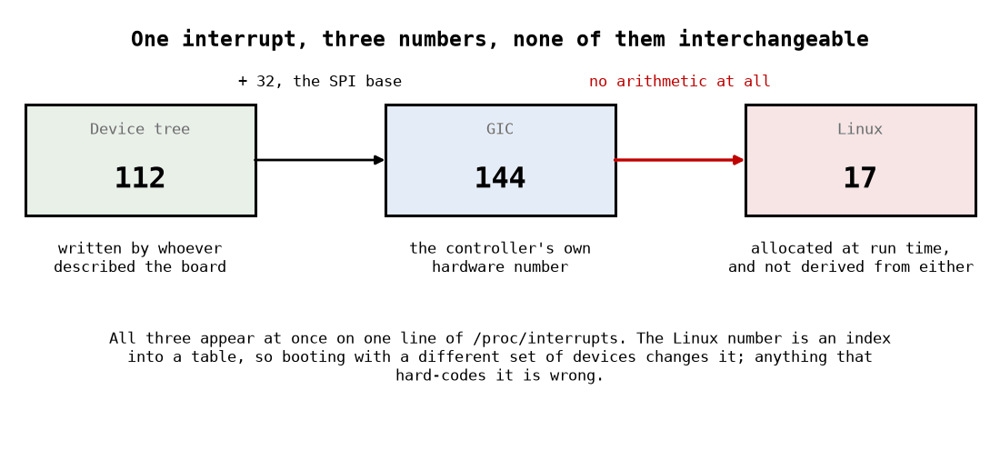

# Appendix A - Interrupts
The path from a wire going high to your function being called, what that function owes the system,
and what happens when it does not pay. [Appendix B](./b_deferred_work.md) is where the work goes
instead.

The idea to carry: **an interrupt handler runs on time borrowed from whatever was running.** Every
rule about handlers follows from that one fact, and none of them has to be memorised separately.

---

## A.1 Three numbers, not one

This is where an afternoon goes if you do not know it in advance. The same interrupt has three
different identities.

On the target, with the lab's module loaded:

```text
# grep qa_irq /proc/interrupts
 17:       1789          0  GIC-0 144 Level     qa_irq
```

and the device tree that produced it says:

```text
interrupts = <0x00 0x70 0x04>;
```

| Number             | Where it comes from                                  | Value here |
| ------------------ | ---------------------------------------------------- | ---------- |
| **The DT cell**    | Written by whoever described the board. `0x70` = 112 | 112        |
| **The GIC number** | Hardware. SPI 112 plus the 32-entry SPI base         | **144**    |
| **The Linux IRQ**  | Allocated at run time when the mapping is created    | **17**     |

$112 + 32 = 144$, and 17 is not derived from either: it is an index into the kernel's own table,
handed out in the order mappings are created. **Boot the machine with a different set of devices
and it changes.**

The table has a name worth knowing, because the kernel's documentation uses it and nothing else
does: an **IRQ domain** (`struct irq_domain`) is one controller's mapping from its own hardware
numbers to Linux ones. The GIC registers a domain at boot; asking that domain to map hardware 144
is what produced 17. A driver never creates a domain or looks inside one, and this is the last time
this course mentions it. It matters only so that the word is not new when you meet it in
`Documentation/core-api/irq/`, where the two numbers are called the `hwirq` and the `virq`.

The three cells of the DT property are, for a GIC: interrupt type (0 = SPI, 1 = PPI), the number
within that type, and the flags (4 = level-triggered, active high). L10 is where a driver stops
parsing these and lets `platform_get_irq` do it.

**So when a datasheet says interrupt 112 and `/proc/interrupts` says 17, nothing is wrong.** They
are answers to different questions.



---

## A.2 Reading `/proc/interrupts`

```text
 17:       1789          0  GIC-0 144 Level     qa_irq
 ^          ^            ^   ^     ^   ^        ^
 |          |            |   |     |   |        +-- the name you passed to request_irq
 |          |            |   |     |   +----------- trigger type
 |          |            |   |     +--------------- hardware number
 |          |            |   +--------------------- which interrupt controller
 |          |            +------------------------- count on CPU1
 |          +-------------------------------------- count on CPU0
 +--------------------------------------------------- the Linux IRQ number
```

Two diagnostics come almost free from that line:

* **A count that is not moving, with a device that is not working**, means the interrupt is not
  reaching the CPU at all: wrong number, wrong trigger type, controller not configured, device not
  actually asserting. Nothing in your handler is at fault, because it has not run.
* **A count racing away** means the opposite: it is arriving and you are not clearing it. A.6.

**The counts belong to the interrupt descriptor, not to your handler.** They are not reset by
`free_irq`, so unloading and reloading a module continues from where it left off:

```text
after the first load:                919
immediately after loading again:     993      <- not zero
one second later:                   1885
```

The line disappears while nothing is registered and comes back with its history. Any measurement
of an interrupt rate therefore has to take a **delta**, and the Cross-check is built on that.

---

## A.3 Getting the number, and the handler

```c
ret = request_irq(irq, qa_hard, 0, "qa_irq", &private);
```

| Argument | Is                                                                                                                 |
| -------- | ------------------------------------------------------------------------------------------------------------------ |
| `irq`    | The **Linux** number, not the hardware one                                                                         |
| handler  | Your function                                                                                                      |
| flags    | `IRQF_SHARED`, `IRQF_ONESHOT`, trigger overrides                                                                   |
| name     | What appears in `/proc/interrupts`. Use the driver's name                                                          |
| `dev_id` | An opaque cookie handed back to your handler, and the key `free_irq` uses to identify which registration to remove |

`dev_id` matters on shared lines: several drivers register handlers for one number, and it is how
the kernel and your own handler tell which device is being talked about. It must be unique per
registration, which is why drivers pass their private structure and never `NULL` when sharing.

**In this lecture the number comes from the device tree directly**, because the module is not yet a
driver bound to a device:

```c
np  = of_find_compatible_node(NULL, NULL, "qacademy,qa-dev-1.0");
irq = irq_of_parse_and_map(np, 0);
```

That is a small taste of [L10](../../L10/README.md), which replaces both lines with
`platform_get_irq(pdev, 0)` and deletes the search.

### The return value

```c
static irqreturn_t qa_hard(int irq, void *dev_id);
```

| Return            | Means                                                                             |
| ----------------- | --------------------------------------------------------------------------------- |
| `IRQ_HANDLED`     | This was mine and I dealt with it                                                 |
| `IRQ_NONE`        | **Not mine.** Some other device on this shared line                               |
| `IRQ_WAKE_THREAD` | Mine; run the threaded half. See [B.4](./b_deferred_work.md#b4-threaded-handlers) |

**`IRQ_NONE` is not an error and returning `IRQ_HANDLED` unconditionally is a real bug.** On a
shared line the kernel uses these to detect a stuck interrupt: if nobody ever claims responsibility
it eventually disables the line and prints `nobody cared`. A handler that always says "mine"
prevents that diagnosis for every other device sharing the line, and the symptom appears in
somebody else's driver.

The first thing a handler should do is read its own status register and return `IRQ_NONE` if
nothing is pending.

---

## A.4 Level and edge

|               | Level-triggered                                | Edge-triggered                  |
| ------------- | ---------------------------------------------- | ------------------------------- |
| The device    | Holds the line asserted until told to stop     | Pulses it                       |
| To stop it    | Your handler must clear the source             | Nothing; the pulse is over      |
| If you forget | The handler is re-entered immediately, forever | The interrupt is simply lost    |
| Missed events | Cannot be missed while asserted                | Can be, if two arrive too close |

`qa-dev` is **level-triggered**, which the device tree records as the `4` in
`interrupts = <0 112 4>`. So its line stays high until the guest clears `IRQ_STATUS`, and A.6 is
what happens if you do not.

Neither is better. Level triggering cannot lose an event and requires an acknowledgement; edge
triggering needs no acknowledgement and can coalesce two events into one. Real hardware uses both,
and a driver written for one and configured for the other fails in a characteristic way: with edge
configured for a level device, you get exactly one interrupt and then silence.

---

## A.5 Acknowledging, and the order

`qa-dev`'s `IRQ_STATUS` is **write-one-to-clear**: writing a bit clears it, writing zero to a bit
leaves it alone. So an acknowledgement is a read followed by writing back what you read.

```c
u32 status = readl(regs + QA_DEV_IRQ_STATUS);
if (!(status & (QA_DEV_IRQ_SAMPLE | QA_DEV_IRQ_OVERRUN)))
        return IRQ_NONE;

writel(status, regs + QA_DEV_IRQ_STATUS);      /* acknowledge exactly what we saw */

/* then do the work: drain the FIFO */

return IRQ_HANDLED;
```

**Write back the value you read, not a mask of everything.** Writing `0xFFFFFFFF` clears bits that
were set after your read, and the events they represented are gone.

**And acknowledge before the work, not after.** The order matters for a reason worth working
through: if you clear the status and then read the FIFO, an event arriving in between sets the
status bit again *and* adds to the FIFO you are about to drain. You then service it, and on a
device whose bit only the write clears you leave the status bit set, so you get one spurious
interrupt with nothing to do. That is survivable. The opposite arrangement, draining and then
acknowledging with the value read on entry, clears the bit of an event that arrived after the
drain, and its sample waits in the FIFO with no interrupt to collect it, which is not.

There is a second valid strategy for this device: draining the FIFO completely clears
`IRQ_SAMPLE` on its own, because the device clears it when the FIFO empties, which is also why
`qa-dev` does not even produce the spurious interrupt. It covers `IRQ_SAMPLE` only. `IRQ_OVERRUN`
is cleared by the write and by nothing else, so a driver that relies on the drain alone wedges the
machine the first time a sample is dropped. Knowing *which* mechanism you are relying on is the
difference between a driver you can reason about and one that happens to work.


---

## A.6 What a missing acknowledgement does

Not a warning, and not a slow driver. The lab's module with nothing in its handler that clears
`IRQ_SAMPLE`, neither the `writel` to `IRQ_STATUS` nor the drain, since on this device emptying the
FIFO clears it too (A.5), loaded on the target:

```text
qa_irq: phys=0xc000000 irq=17
qa_irq: running, period_ns=1000000 threaded=0
[   29.847211] rcu: INFO: rcu_preempt detected stalls on CPUs/tasks:
[   29.848268] rcu:  0-....: (0 ticks this GP) idle=3cd4/1/0x4000000000000002
[   29.850382] Sending NMI from CPU 1 to CPUs 0:
```

**`insmod` never returned.** The line stays asserted, so the handler is re-entered the instant it
returns, forever. CPU0 does nothing else from that moment on; twenty-six seconds later the RCU
stall detector notices that a grace period has made no progress and CPU1 sends an NMI to find out
what CPU0 is doing.

The machine is gone. It does not recover, and this course's test harness reports it as a **timeout**
rather than a failure, which is the distinction `ci/test.sh` draws precisely because this class of
bug does not produce a failing test, it produces no test result at all.

Worth noticing: the symptom is an RCU stall, which mentions neither interrupts nor your driver. The
first line of a real diagnosis is `/proc/interrupts` from another CPU, where the count is
astronomical.

---

## A.7 What a handler may not do

One rule, from which the list follows: **a handler may not sleep.**

It runs in interrupt context, on a CPU borrowed from whatever it interrupted (on arm64, on that
CPU's own interrupt stack), with its own line masked and every other interrupt on that CPU disabled.
There is no task to put to sleep and nothing to schedule in its place.

| Forbidden             | Use instead                             |
| --------------------- | --------------------------------------- |
| `kmalloc(GFP_KERNEL)` | `GFP_ATOMIC`, or allocate in advance    |
| `mutex_lock`          | `spin_lock_irqsave`, or defer the work  |
| `copy_to_user`        | Defer it; there is no user context here |
| `msleep`, `schedule`  | Defer it                                |
| `wait_event`          | Defer it                                |

The second rule follows from the first being about *borrowed time*: **be quick.** Every
microsecond in a handler is a microsecond stolen from a task that had done nothing wrong, and on a
shared or high-rate line it is multiplied. That is what [Appendix B](./b_deferred_work.md) is for,
and what [L12](../../L12/README.md) measures.

`CONFIG_DEBUG_ATOMIC_SLEEP`, which this course enables, turns a sleep in interrupt context into a
`BUG: sleeping function called from invalid context` with a backtrace instead of an intermittent
hang. [L07](../../L07/appendix/a_concurrency_and_locks.md#a7-atomic-context) is the same rule seen
from the locking side.

---

## A.8 Sharing data with a handler

The handler and the rest of your driver touch the same data, and the handler can arrive between any
two instructions of the rest.

```c
spin_lock_irqsave(&priv->lock, flags);
/* ... */
spin_unlock_irqrestore(&priv->lock, flags);
```

`irqsave` and not plain `spin_lock`, for the reason
[L07 A.5](../../L07/appendix/a_concurrency_and_locks.md#a5-spinlocks) gives: process context takes
the lock, the device interrupts the same CPU, the handler spins for a lock that cannot be released
until the handler returns, and the machine stops. Disabling interrupts on this CPU for the length
of the critical section is what prevents it.

Inside the handler itself, plain `spin_lock` is enough: interrupts are already masked there.

The lightest option is often no lock at all. A counter the handler increments and userspace only
reads can be an `atomic_t`; the lab's module uses exactly that, and
[L07 A.3](../../L07/appendix/a_concurrency_and_locks.md#a3-atomics-and-the-thing-they-do-not-fix)
is the rule for when that stops being enough.

---
