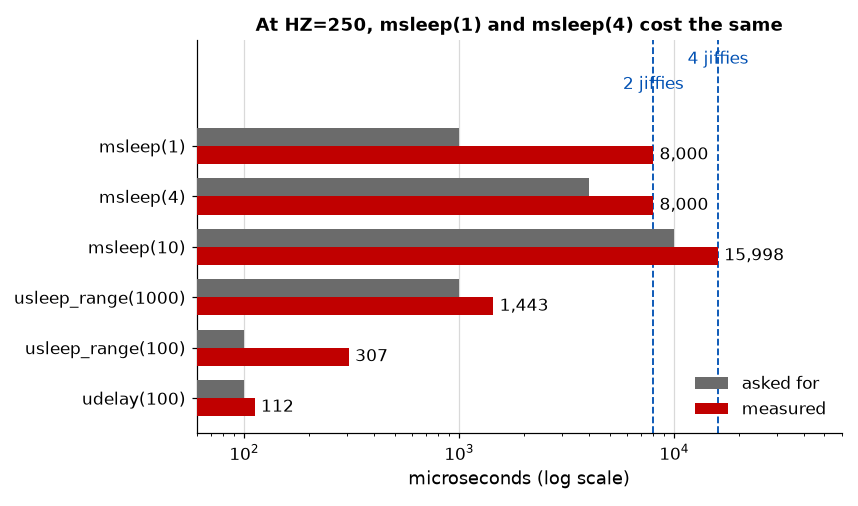

# Appendix B - Time, Delays and Timers
Four ways to say "later", how much later each of them actually means, and why the difference is
larger than anyone expects.

Every number here was measured on this course's target with the lab's `qa_timing` module, at
`HZ=250`. Yours will match, because they are properties of the configuration rather than of the
machine.

---

## B.1 Jiffies, and why not to quote them

The kernel counts ticks in a global `jiffies`. The tick rate is `HZ`, a compile-time constant:

```text
# zcat /proc/config.gz | grep '^CONFIG_HZ='
CONFIG_HZ=250
```

so on this kernel **one jiffy is 4 milliseconds**. Common values are 100, 250, 300 and 1000, and
which one a distribution picks is a trade between timer resolution and tick overhead.

**A jiffy is not a unit of time.** It is a unit of ticks, and the same code on a `HZ=1000` kernel
waits a quarter as long. Any duration you care about should be written in real units and converted:

```c
unsigned long timeout = jiffies + msecs_to_jiffies(500);
if (time_after(jiffies, timeout)) { /* ... */ }
```

`time_after` and `time_before` rather than `<` and `>`, because `jiffies` wraps. On a 32-bit
counter at `HZ=250` that is once every 199 days, and the comparison macros handle it; a naive
comparison produces a driver that misbehaves twice a year.

---

## B.2 `ktime`, for measuring

Jiffies are for *scheduling*. For *measuring*, use `ktime`, which is nanoseconds:

```c
ktime_t start = ktime_get();
/* ... */
s64 us = ktime_us_delta(ktime_get(), start);
```

| Clock                | Reads                       | Use for                        |
| -------------------- | --------------------------- | ------------------------------ |
| `ktime_get`          | Monotonic since boot        | **Intervals.** Always this one |
| `ktime_get_real`     | Wall-clock time             | Timestamps a human will read   |
| `ktime_get_boottime` | Monotonic, includes suspend | Intervals across a sleep       |

**Measure intervals with the monotonic clock.** Wall-clock time can jump forwards or backwards
when NTP corrects it or somebody sets the date, and an interval computed across that is nonsense,
occasionally negative. This is the same rule userspace has with `CLOCK_MONOTONIC`, and it is the
one [L12](../../L12/README.md) depends on entirely.

---

## B.3 Delaying against sleeping

Two families, and confusing them is a correctness bug rather than a performance one.

| Function             | Mechanism   | Context                   | Costs                   |
| -------------------- | ----------- | ------------------------- | ----------------------- |
| `udelay(n)`          | Busy-wait   | **Any**, including atomic | A CPU, entirely         |
| `mdelay(n)`          | Busy-wait   | Any                       | A CPU, for milliseconds |
| `msleep(n)`          | Timer wheel | Process context only      | Nothing                 |
| `usleep_range(a, b)` | hrtimer     | Process context only      | Nothing                 |

**The `delay` family burns a CPU** and is legal in atomic context precisely because it never
sleeps. **The `sleep` family gives the CPU up** and cannot be used where sleeping is forbidden.

The rule: **use `udelay` only for short hardware delays in code that cannot sleep**, and only for
a few microseconds. `udelay(5000)` is legal, compiles, works, and spends five milliseconds of a
CPU doing nothing, which is a real-time problem that [L12](../../L12/README.md) will come back to.
`mdelay` exists mostly so that its name can warn you.

---

## B.4 What the sleeps actually cost

This is the measurement that surprises people. From the lab's `qa_timing`, 200 repetitions of
each, at `HZ=250` where one jiffy is 4000 us:

| Call                 | Asked for | Measured, each | Ratio |
| -------------------- | --------- | -------------- | ----- |
| `msleep(1)`          | 1,000 us  | **8,000 us**   | 8.0x  |
| `msleep(4)`          | 4,000 us  | **8,000 us**   | 2.0x  |
| `msleep(10)`         | 10,000 us | 15,998 us      | 1.6x  |
| `usleep_range(1000)` | 1,000 us  | 1,443 us       | 1.4x  |
| `usleep_range(100)`  | 100 us    | 307 us         | 3.1x  |
| `udelay(100)`        | 100 us    | 112 us         | 1.1x  |

**`msleep(1)` and `msleep(4)` take exactly the same time.** Asking for a quarter as long got
nothing. That single row is the most useful thing in this appendix: `msleep` is quantised to
jiffies, and below one jiffy the argument stops carrying information.

The arithmetic is exact and you can reproduce it. `msecs_to_jiffies` rounds **up**:

| Call         | `msecs_to_jiffies` | Plus the guarantee | Total             |
| ------------ | ------------------ | ------------------ | ----------------- |
| `msleep(1)`  | 1 jiffy            | +1                 | 2 jiffies = 8 ms  |
| `msleep(4)`  | 1 jiffy            | +1                 | 2 jiffies = 8 ms  |
| `msleep(10)` | 3 jiffies          | +1                 | 4 jiffies = 16 ms |

Where the extra jiffy comes from is worth knowing, because it is not in `msleep`'s source.
`schedule_timeout`'s own documentation says:

> at least @timeout jiffies are guaranteed to pass before the routine returns

**"At least" is the whole answer.** You call it partway through a jiffy, and the kernel does not
know how far through. To guarantee that N jiffies have *elapsed*, it must wait for N+1 ticks. The
overshoot is the price of a guarantee that never returns early.

**`usleep_range` is the fix**, and the table shows why: it uses hrtimers rather than the jiffy
wheel, so a 1 ms request costs 1.4 ms instead of 8 ms. It takes a range because giving the kernel
slack lets it coalesce your timer with others already due, which saves wakeups on a system trying
to stay idle. Use it for anything between about 10 us and 20 ms; `msleep` above that, where the
jiffy quantum stops mattering.



---

## B.5 Timers

Two kinds, and the difference is the same jiffy-against-nanosecond split.

### `timer_list`, on the jiffy wheel

```c
static struct timer_list my_timer;

timer_setup(&my_timer, my_callback, 0);
mod_timer(&my_timer, jiffies + msecs_to_jiffies(500));
```

Resolution is a jiffy, and the wheel deliberately batches timers into buckets, so a long timeout
may be rounded by a noticeable fraction. That is a feature: it lets an idle system stay idle.

**The callback runs in softirq context**, so it may not sleep, may not take a mutex, and may not
call `copy_to_user`. This catches people, because the code around a timer is usually process
context and the callback looks like it belongs to it.

`timer_delete_sync` before freeing anything the callback touches, and note the *sync*: it waits
for a callback already running on another CPU. `timer_delete` alone can return while the callback
is still executing on the memory you are about to free. Most code you will read calls them
`del_timer_sync` and `del_timer`, the old names, which 6.12 keeps as wrappers marked not for new
code.

### `hrtimer`, on real time

```c
hrtimer_init(&my_hrtimer, CLOCK_MONOTONIC, HRTIMER_MODE_REL);
my_hrtimer.function = my_callback;
hrtimer_start(&my_hrtimer, ms_to_ktime(500), HRTIMER_MODE_REL);
```

Note that the callback is assigned to the structure rather than passed to the initialiser. That is
the 6.12 interface; a later kernel introduces `hrtimer_setup`, which takes the callback as an
argument and is what newer material will show you. This is
[L03's](../../L03/appendix/a_the_kernel_and_its_tree.md#a2-the-one-public-interface-and-the-one-that-is-not)
unstable internal API again, in a function you would meet in your first week.

Nanosecond resolution, backed by a real hardware timer rather than the tick. The callback returns
`HRTIMER_NORESTART` or `HRTIMER_RESTART`, which makes periodic timers straightforward.

hrtimers cost more per timer, so the kernel uses the wheel for the many timeouts that never expire
(network retransmits, mostly) and hrtimers for the few that must be accurate.

### Choosing

| Use                              | Because                                                   |
| -------------------------------- | --------------------------------------------------------- |
| `timer_list` for a timeout       | It will usually be cancelled, and precision is irrelevant |
| `hrtimer` for a deadline         | You need the resolution, and it will fire                 |
| Neither, if an interrupt will do | The device already knows when it has data                 |

That last row is worth stating. This course's driver could poll the device on a timer; it does not,
because [L08](../../L08/README.md) gave it an interrupt. **A timer is what you use when nothing
tells you.** The exercises ask you to build the timer version anyway and compare, because the
comparison is the argument.

---

## B.6 What none of this gives you

**None of it is a guarantee about the maximum.** Everything above is "at least", and the numbers in
B.4 are averages over 200 repetitions on an idle machine. What happens to the worst case under load
is not in this appendix, is not what `msleep` documents, and is the subject of
[L12](../../L12/README.md).

**And the measurements themselves contain the emulator.** The 1,443 us for a 1 ms `usleep_range` is
this target's number, and part of it belongs to QEMU rather than to Linux. That is the same caution
[L08's Cross-check](../../L08/appendix/c_exercises.md) arrives at, and L12 states it in full.

---
