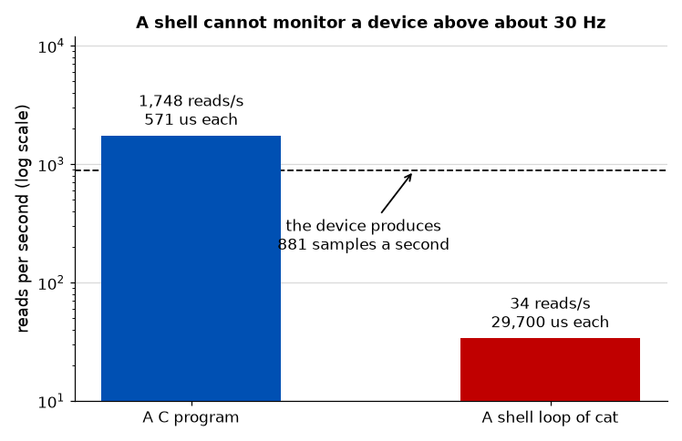

# Appendix A - Kernel Frameworks
Why your driver probably should not be a character device, what a subsystem gives you in exchange
for implementing its interface, and how to tell which one a device belongs to.

The argument in one sentence: **a character device is an interface you invent and then maintain
forever; a framework is an interface that already exists and that other people's tools already
speak.**

---

## A.1 What you have, and what you do not

By [L10](../../L10/README.md) the driver works. It probes off the device tree and services its
interrupt, and in [L09](../../L09/README.md) it presented `/dev/qa_wait` with a `read()` you wrote.
Nothing is broken.

Now list what it does not have:

* No way for a program that does not know about it to find it.
* No documented interface. Yours exists in your head and in the source.
* No existing tools. Every user writes their own reader.
* No power management. Suspend and resume do nothing.
* No way to express what the device *is*, only what it does.

Each of those is something a subsystem provides, and provides identically for every driver in it.
That is the trade: **you implement an interface someone else designed, and you stop having to
design, document, version and support one of your own.**


---

## A.2 The cost of the shortcut

Adding an `ioctl` is always the path of least resistance. It is worth knowing what it costs before
taking it.

**It is an ABI the moment a second program uses it.** The numbers and the structure layout are
frozen; you may add but never change or remove. There is no deprecation period for something a
customer's binary calls.

**It is a portability trap.** A 32-bit process on a 64-bit kernel passes a differently laid-out
structure, and handling that needs `compat_ioctl` and a structure with no implicit padding and no
`long`. Getting this wrong is a standing source of kernel bugs, and it is invisible until somebody
runs a 32-bit binary.

**It is undiscoverable.** `ls /sys/bus/iio/devices` finds every IIO device on a machine. Nothing
finds every device that implements your ioctl.

**And there is usually already a subsystem for it.** The kernel has spent thirty years accumulating
interfaces for classes of hardware, and "a thing that produces samples" or "a thing with
controllable pins" are both very well-trodden.

---

## A.3 The tour

Ten subsystems worth recognising, with the question each answers.

| Subsystem        | For                               | Userspace sees                              |
| ---------------- | --------------------------------- | ------------------------------------------- |
| **gpio**         | Individually controllable pins    | `/dev/gpiochipN`, libgpiod                  |
| **pinctrl**      | What a pin is multiplexed *as*    | Nothing directly; other drivers             |
| **clk**          | Clock sources and gates           | Nothing directly; `/sys/kernel/debug/clk`   |
| **regulator**    | Power supplies                    | Read-only `/sys/class/regulator`            |
| **i2c**, **spi** | Devices on those buses            | `/dev/i2c-N`, `/dev/spidevN.M`              |
| **regmap**       | Register access over any of those | Nothing; it is a driver-side helper         |
| **iio**          | Anything that samples or converts | `/sys/bus/iio/devices/`, `/dev/iio:deviceN` |
| **input**        | Keys, buttons, touch, motion      | `/dev/input/eventN`                         |
| **mtd**          | Raw flash                         | `/dev/mtdN`, `/dev/mtdblockN`               |
| **watchdog**     | A timer that reboots the machine  | `/dev/watchdog`                             |

Four of them are worth more than a row.

**pinctrl** is the one people are surprised to need. Before a pin can be a GPIO it has to be
*multiplexed* as one rather than as a UART line or an I2C signal, and that is a different piece of
hardware in the SoC. Your driver should not be doing it: the pin configuration belongs in the
device tree, and pinctrl applies it before your `probe` runs.

**clk and regulator** exist because the answer to "turn the device on" is shared and refcounted.
Two drivers on one clock is the normal case, and a driver that writes the gate register directly
works until the second one disagrees with it. `devm_clk_get` and `clk_prepare_enable` cost two
lines and are correct with any number of consumers.

**regmap** is a driver-side helper rather than a userspace interface. Most drivers for an I2C or
SPI chip contain the same fifty lines of read-modify-write, byte-order and caching; regmap replaces
them with a *description*, which registers exist, which are volatile, which are cacheable, and
handles the rest. It is worth reaching for the moment a driver has more than a handful of
registers.

**iio** is where anything that measures belongs. Not just ADCs: accelerometers, light sensors,
pressure, temperature, DACs, anything with a value and a unit. It carries scale, offset and units
so that userspace can convert raw counts into volts without knowing anything about the chip.

**Two of the ten you will drive yourself and eight you will only have read about**, which is worth
knowing before the table starts to feel like competence: A.4 and A.5 register `qa-dev` with iio and
gpio and the lab checks both, but `qa-dev` sits on no bus and has no clock or regulator to ask for,
so nothing here can teach you what regmap feels like against a real I2C part.

---

## A.4 Registering with IIO

The whole of it, for a device with one channel:

```c
indio_dev = devm_iio_device_alloc(&pdev->dev, sizeof(*priv));
priv      = iio_priv(indio_dev);

indio_dev->name          = "qa_dev";
indio_dev->info          = &qa_iio_info;      /* .read_raw = qa_read_raw */
indio_dev->modes         = INDIO_DIRECT_MODE;
indio_dev->channels      = qa_channels;
indio_dev->num_channels  = ARRAY_SIZE(qa_channels);

ret = devm_iio_device_register(&pdev->dev, indio_dev);
```

`devm_iio_device_alloc` allocates the IIO device *and* your private structure in one object;
`iio_priv()` gets yours back out. That is the framework's idiom for per-device state and it
replaces the `devm_kzalloc` from L10.

The channel says what the value *is*:

```c
static const struct iio_chan_spec qa_channels[] = {
        {
                .type                = IIO_VOLTAGE,
                .indexed             = 1,
                .channel             = 0,
                .info_mask_separate  = BIT(IIO_CHAN_INFO_RAW),
        },
};
```

and `.info_mask_separate` is the list of attributes to create. `IIO_CHAN_INFO_RAW` makes
`in_voltage0_raw`; adding `IIO_CHAN_INFO_SCALE` would make `in_voltage0_scale`, and userspace
multiplies the two to get millivolts, the unit the IIO ABI documents for a voltage.

`read_raw` is the one callback:

```c
static int qa_read_raw(struct iio_dev *indio_dev, struct iio_chan_spec const *chan,
                       int *val, int *val2, long mask)
{
        struct qa_priv *priv = iio_priv(indio_dev);

        switch (mask) {
        case IIO_CHAN_INFO_RAW:
                *val = atomic_read(&priv->last_sample);
                return IIO_VAL_INT;
        default:
                return -EINVAL;
        }
}
```

**What that buys**, on the target, immediately:

```text
# ls /sys/bus/iio/devices/
iio:device0
# cat /sys/bus/iio/devices/iio:device0/name
qa_dev
# cat /sys/bus/iio/devices/iio:device0/in_voltage0_raw
195
```

No `/dev` node was written, no `read()` implemented, no `ioctl` invented. And because the device is
in counter mode, reading the attribute twice measures the sample rate:

```text
195 ... one second ... 1076
```

881 samples in a second, which is [L08's](../../L08/README.md) interrupt rate arriving through an
interface that knows nothing about interrupts.

---

## A.5 Registering a gpiochip

Five callbacks and a structure:

```c
priv->gc.label           = dev_name(&pdev->dev);
priv->gc.parent          = &pdev->dev;
priv->gc.owner           = THIS_MODULE;
priv->gc.base            = -1;              /* let the core allocate the numbers */
priv->gc.ngpio           = 8;
priv->gc.get             = qa_gpio_get;
priv->gc.set             = qa_gpio_set;
priv->gc.direction_input = qa_gpio_direction_input;
priv->gc.direction_output = qa_gpio_direction_output;
priv->gc.get_direction   = qa_gpio_get_direction;

ret = devm_gpiochip_add_data(&pdev->dev, &priv->gc, priv);
```

`.base = -1` matters: a hardcoded global GPIO number is a legacy practice. This kernel still
accepts one, with a warning that static allocation is deprecated, but two chips whose hardcoded
ranges overlap cannot both register. `gpiochip_get_data(gc)` retrieves the pointer you passed.

Note that `.set` returns `void` in this kernel. It gained an `int` return later, so a driver copied
from newer material will not compile here, and one copied from older material will not compile
there. [L03's](../../L03/appendix/a_the_kernel_and_its_tree.md#a2-the-one-public-interface-and-the-one-that-is-not)
unstable internal API, again.

What appears:

```text
# ls -l /sys/bus/gpio/devices/gpiochip1/of_node
of_node -> .../firmware/devicetree/base/platform-bus@c000000/qa-dev@0
# ls -l /dev/gpiochip1
crw------- 1 root root 254, 1 /dev/gpiochip1
```

The chip is a child of your platform device, linked back to the device tree node it came from, with
a character device the framework created and will remove when the driver unbinds.

**There is no `/sys/class/gpio`.** That interface is deprecated and this course's kernel does not
enable it; the character device replaced it, and a driver written against the sysfs interface is a
driver written against something on its way out. [`kernel/qa.config`](../../../kernel/qa.config)
says so in a comment.

---

## A.6 What userspace can now do

The tester shipped with the lab contains **nothing specific to this driver**. It finds the chip by
the label the driver gave it and then speaks the standard ABI:

```c
ioctl(fd, GPIO_GET_CHIPINFO_IOCTL, &info);        /* what is this chip */
ioctl(chip, GPIO_V2_GET_LINE_IOCTL, &req);        /* give me line 0 as an output */
ioctl(line, GPIO_V2_LINE_SET_VALUES_IOCTL, &v);   /* drive it */
```

```text
found /dev/gpiochip1: label "c000000.qa-dev", 8 lines
  ok  line 0 can be driven high
  ok  line 4 reads high, through the loopback
```

That is the argument, demonstrated: **a program written before your driver existed can drive your
hardware**, because both sides implement an interface neither of them owns. `libgpiod` and its
`gpioinfo`, `gpioget` and `gpioset` tools do exactly this and would work here unchanged.

---

## A.7 Choosing a subsystem

The question is **what the device is**, not what it does.

| The device is                               | Subsystem                         |
| ------------------------------------------- | --------------------------------- |
| Something that measures or converts a value | iio                               |
| Something with individually controlled pins | gpio                              |
| A source of human input                     | input                             |
| Raw flash                                   | mtd                               |
| A timer that resets the board               | watchdog                          |
| A clock source                              | clk                               |
| A power supply                              | regulator                         |
| On an I2C or SPI bus                        | i2c or spi, plus one of the above |

A device is often several: a sensor on I2C that reports temperature is an **i2c** client and an
**iio** device, and those are not competing answers.

**When nothing fits**, a character device is a legitimate answer and not a failure. Write it with
`misc_register` rather than the long way, document the interface, use `_IOR`/`_IOW` properly, and
be honest that you now own an ABI. What is not legitimate is reaching for it because implementing
an interface looked like more work than inventing one.

---

## A.8 What a framework does not do

Worth stating, because the argument above is one-sided by design.

**It does not make your driver correct.** Everything from L06 to L09 still applies: the locking,
the interrupt acknowledgement, the sleeping rules. A framework changes what your driver presents,
not what it has to get right underneath.

**It constrains you to its model.** If your device genuinely does not fit IIO's idea of a channel,
forcing it in produces a driver that is harder to read than a character device would have been.
The model is a good fit surprisingly often and is not a universal one.

**It can be slower, and here is how much.** Going through a subsystem's generic path costs
something against a purpose-built `read()`. Measured on this target, reading `in_voltage0_raw`
repeatedly:

| From                  | Per read  | Rate          |
| --------------------- | --------- | ------------- |
| A C program           | 571 us    | 1,748 reads/s |
| A shell loop of `cat` | 29,700 us | 34 reads/s    |

The shell figure is fifty times worse because each `cat` is a fork and an exec, and it is worth
knowing before you write a monitoring script: **a shell reading sysfs cannot keep up with a device
sampling at more than about thirty hertz.**

Even the C figure is only twice this device's 881 samples a second, so reading the attribute in a
loop is already marginal at one kilohertz and hopeless above it. That is not a criticism of sysfs;
it is what sysfs is for, which is configuration and occasional inspection. **IIO's buffered and
triggered modes exist for exactly this**, delivering batches through `/dev/iio:deviceN` instead,
and a driver that needs them says so by allocating a buffer rather than by abandoning the
framework.

**And it does not remove the ABI problem, it moves it to someone competent.** The GPIO character
device is on its second version, `GPIO_V2_*`, because the first got some things wrong. The
difference is that the migration was designed, documented and supported by the subsystem
maintainers rather than by you.

---



---

